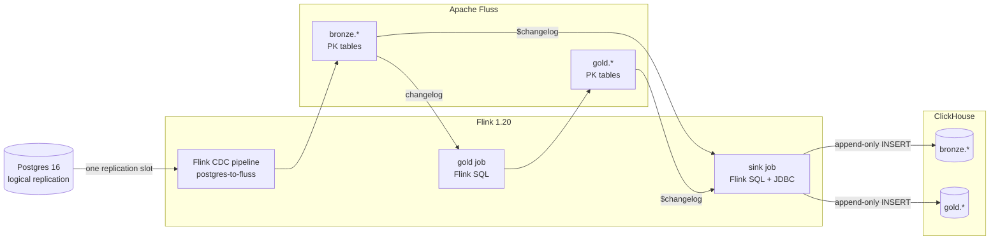

# Real-time CDC: Postgres → Flink CDC → Apache Fluss → ClickHouse

[](https://github.com/salbifaza/stream-flink-fluss/actions/workflows/smoke.yml)
[](LICENSE)


**Postgres changes in ClickHouse in about 1.5 seconds, with no Kafka and no
Debezium, and revenue tables that stay correct when orders are cancelled.**

Flink CDC reads the Postgres write-ahead log and writes every table into
[Apache Fluss](https://fluss.apache.org/), a streaming storage layer that
keeps each table's current state and its full changelog. A Flink SQL job
maintains revenue aggregates in Fluss, and a second one streams every Fluss
changelog into ClickHouse. ClickHouse never runs an UPDATE or DELETE: every
change arrives as an appended row, and `ReplacingMergeTree` keeps the
latest one.

`make verify` proves it end to end. It compares every table with Postgres,
times a live update, and checks that the gold tables still match Postgres
after a cancellation, a rename, a customer moving country and a deleted
line item.

## Results at a glance

| | |
|---|---|
| **Latency** | Postgres `UPDATE` → ClickHouse row in **0.9–2.5 s** (measured per row from `updated_at` to `_synced_at`) |
| **Gold correctness** | All 3 gold tables **identical to Postgres**, row for row, before and after retractions; converged **~3 s** after the last change |
| **Crash safety** | `SIGKILL` on the TaskManager with 2,000 rows in flight: **0 lost, 0 duplicated** |
| **Restart** | Full `docker compose down` / `up`: all 3 jobs **resume from checkpoint**, nothing is replayed |
| **Rebuild safety** | Wiping Fluss, ZooKeeper and Flink state entirely: ClickHouse still converges to Postgres |
| **Least privilege** | The sink writes as a user with **`INSERT` only**, on two databases |

## Architecture



| Layer | In Fluss | In ClickHouse |
|---|---|---|
| **bronze** | The 6 source tables (`categories`, `customers`, `products`, `orders`, `order_items`, `payments`), current state | One `ReplacingMergeTree` replica per table |
| **gold** | `daily_revenue`, `category_revenue`, `customer_ltv`, maintained by [`gold_job.sql`](flink/sql/gold_job.sql) | Same three tables |

```sql
SELECT * FROM gold.customer_ltv FINAL ORDER BY lifetime_value_cents DESC;
```

## Run it in 2 commands

Requires Docker Compose v2 and about 5 GB of free RAM (the stack uses ~3 GB).

```bash
make up       # build, start 7 containers, submit the 3 Flink jobs
make verify   # counts, live insert/update/delete + latency, gold vs. Postgres
```

The first run takes a few minutes: it pulls images and compiles the
ClickHouse dialect inside the Docker build. A passing run:

```
== Step 1: bronze row counts, Postgres vs. ClickHouse (FINAL) ==
  categories   postgres=5     clickhouse=5     OK
  ...
  payments     postgres=30    clickhouse=30    OK

== Step 2: live insert / update / delete ==
  insert propagated: yes
  update propagated: yes
  delete propagated: yes
  latency, Postgres UPDATE -> ClickHouse row: 1561 ms (Fluss commit -> ClickHouse: 606 ms)

== Step 3: gold tables vs. the same aggregates computed in Postgres ==
  gold.daily_revenue      22 rows, identical to Postgres  OK
  gold.category_revenue    5 rows, identical to Postgres  OK
  gold.customer_ltv       15 rows, identical to Postgres  OK

  changes that need retractions:
    toggle order_id=5 between 'paid' and 'cancelled'   (revenue leaves / rejoins its day, category, customer)
    toggle customer_id=4 country US <-> CA             (an already-joined gold row changes in place)
    toggle a ' (renamed)' suffix on category_id=3      (a dimension change on the right side of a join)
    insert a line item on order_id=2, then delete it   (an aggregate goes up, then back down)
  gold.daily_revenue      21 rows, identical to Postgres  OK
  gold.category_revenue    5 rows, identical to Postgres  OK
  gold.customer_ltv       15 rows, identical to Postgres  OK
  gold converged 3s after the last source change.

Verification PASSED.
```

`daily_revenue` dropping from 22 to 21 rows is a day whose only order was
cancelled: the group disappears in Flink, and the delete reaches ClickHouse.

```bash
make status   # Flink jobs, replication slot WAL, ClickHouse rows and last arrival
make deploy   # resubmit any job that isn't running (resumes from checkpoint)
make down     # stop, keep data
make reset    # stop and wipe everything
```

Flink UI: http://localhost:8089 · ClickHouse HTTP: http://localhost:8125 ·
Postgres: `localhost:5435`

## How a changelog becomes ClickHouse rows

ClickHouse has no cheap row-level UPDATE or DELETE, so the sink never issues
one. Every Fluss table exposes a `$changelog` virtual table, an append-only
stream with `_change_type`, `_log_offset` and `_commit_timestamp` on every
row. The sink job:

1. drops `update_before` rows, since the `update_after` that follows carries the new state
2. appends everything else, with `is_deleted = 1` for deletes
3. lets ClickHouse compute a `_version` that only grows per key

`SELECT ... FINAL` then keeps the newest version of each key and hides
deleted keys. A replayed change carries the same version as the original, so
the at-least-once JDBC sink is idempotent.

There was one missing piece. Flink's JDBC connector has no ClickHouse
dialect, and ClickHouse's own Flink connector supports only the DataStream
API. [`flink/clickhouse-dialect`](flink/clickhouse-dialect) adds one in
about 100 lines of Java through the connector's `JdbcFactory` SPI. It
deliberately has no upsert statement, and each Flink flush becomes a single
multi-row `INSERT`.

## Four things that broke

### 1. Old data silently beat new data after a restart

The first design used the Fluss log offset as `_version`. After a
`docker compose down` and `up`, an order cancelled in Postgres stayed
`delivered` in ClickHouse:

```
 order_id │ status    │ _log_offset
        1 │ delivered │          35   <- before the restart
        1 │ delivered │          28   <- recreated table, re-snapshot
        1 │ cancelled │          31   <- the real latest change, loses to 35
```

ZooKeeper had no volume, so Fluss lost its metadata, the pipeline recreated
every table, and offsets restarted at 0. Two fixes: ZooKeeper is now
persisted, and `_version` is ordered by commit time first, then offset. I
reproduced the failure by wiping the whole Fluss/Flink tier, and ClickHouse
converged anyway.
→ [The version column](docs/architecture.md#the-version-column)

### 2. The Fluss reader ran out of direct memory

Replaying a few thousand changelog rows crashed the gold job three times
with `OutOfMemoryError: Direct buffer memory`. The Fluss client decodes
Arrow batches off-heap, and Flink reserves no task off-heap memory by
default. Fixed with `taskmanager.memory.task.off-heap.size: 256m`.

### 3. A restarted JobManager forgets every job

Without an HA store, a JobManager restart drops all jobs, and a fresh
resubmit re-snapshots Postgres and replays every changelog.
`scripts/deploy.sh` now records each job's id by name and resumes it from
its newest retained checkpoint. After a full `down` / `up`, all three jobs
resumed and ClickHouse received zero replayed rows.
→ [Restart behaviour](docs/architecture.md#3-a-restarted-jobmanager-forgets-every-job)

### 4. The SQL client reports success when nothing was submitted

`sql-client.sh -f` exits 0 when a statement fails, and also for an empty
file. A bug in my own submit script emptied the sink SQL, and the deploy
"succeeded" with no sink running. The runner now fails on `[ERROR]` and
requires a `Job ID` from every job file.

Three known Flink CDC 3.6 issues are also handled up front:
`TIMESTAMPTZ` is unsupported by the Fluss sink, the default
`REPLICA IDENTITY` crash-loops on the first `UPDATE`, and without a
checkpoint interval streaming never starts.
→ [All findings](docs/architecture.md#findings)

## Do you actually need Fluss?

Not strictly. It does one specific job here: Flink SQL produces
changelogs (inserts, update pairs, deletes, and constant retractions from
the gold aggregates), and ClickHouse can't absorb those efficiently. Fluss's
`$changelog` turns every change into an appended row with a change type and
an ever-growing offset, which is exactly what `ReplacingMergeTree` needs. As
far as I know, Flink 1.20 SQL has no built-in way to do that conversion, so
Fluss is what keeps the whole pipeline in plain SQL with no custom Java.

| | Cost of Fluss | What it buys |
|---|---|---|
| **Infrastructure** | 3 more containers (coordinator, tablet, ZooKeeper), ~540 MB RAM | One replication slot feeds both Flink jobs |
| **Code** | None | Changelog → append rows for every table, with no custom code |
| **Operations** | 2 of the 4 findings above came from Fluss | Consumers replay from Fluss, not the production database |

**Without it,** the cleanest design is one Flink job using Flink CDC's
DataStream API: write each change event with its `op` field, and use the
Postgres LSN as `_version`. That removes three containers, and the LSN is
ordered globally, so finding 1 couldn't happen at all. The price is a few
hundred lines of Java, including the code that turns gold retractions into
rows. If all you need is a mirror, with gold recomputed on a schedule, a
dedicated replication tool like PeerDB is simpler still.

**Fluss earns its place when** more than one system consumes the change
stream, when jobs need lookup joins against current state, when the data
should also tier into a lakehouse such as Iceberg, or when consumers are
rebuilt often enough that re-reading the production database hurts.

## What I'd change for production

| Gap | Risk | What I'd do |
|---|---|---|
| No Flink HA | A JobManager restart needs `make deploy` to resume jobs | Flink Kubernetes operator with HA and savepoints |
| Single Fluss tablet server, single ZooKeeper | One failure stops the pipeline | 3+ tablet servers with replication; a ZooKeeper ensemble |
| Rebuilds after losing Fluss | Rows deleted during the outage stay in ClickHouse | Truncate the ClickHouse replicas as part of a rebuild |
| Clock assumption in `_version` | A tablet clock jumping backwards could reorder changes | NTP with slew-only correction; alert on clock steps |
| No TLS | Plaintext Postgres, Fluss and ClickHouse traffic | TLS on every connection |
| Fixed sink schema | A new Postgres column reaches Fluss but not ClickHouse | Versioned DDL and a migration runbook |
| Unbounded join state in the gold job | State grows with the tables | RocksDB backend + `table.exec.state.ttl` |
| Tiny data volumes | Proves correctness, not throughput | Load test; tune parallelism, buckets, flush size |

## Under the hood

<details>
<summary><b>Services and ports</b></summary>

| Service | Role | Host port |
|---|---|---|
| `source-postgres` | OLTP source, `wal_level=logical` | `5435` |
| `zookeeper` | Fluss cluster metadata (persisted) | — |
| `fluss-coordinator` / `fluss-tablet` | Fluss cluster | — |
| `flink-jobmanager` / `flink-taskmanager` | 3 jobs, 4 slots, 3 GB | `8089` (UI + REST) |
| `clickhouse` | Destination | `8125` (HTTP), `9011` (native) |

Fluss's KV snapshots go to a volume shared with Flink, because Flink reads
them directly when it scans a primary-key table.

</details>

<details>
<summary><b>Versions</b></summary>

Flink 1.20.5 · Flink CDC 3.6.0 · Fluss 0.9.1-incubating ·
flink-connector-jdbc 3.3.0-1.20 · clickhouse-jdbc 0.9.9 · ClickHouse 25.8 ·
Postgres 16

</details>

<details>
<summary><b>Repo layout</b></summary>

```
docker-compose.yml                Full stack
Makefile                          up, deploy, verify, status, down, reset, smoke
.env.example                      Credentials (defaults work as-is)

flink/Dockerfile                  Flink + Flink CDC + Fluss + JDBC jars; builds the dialect
flink/clickhouse-dialect/         ClickHouse dialect for Flink's JDBC connector
flink/postgres-to-fluss.yaml      CDC pipeline: public.* -> Fluss bronze.*
flink/sql/gold_job.sql            bronze -> gold aggregates
flink/sql/clickhouse_sink_job.sql bronze + gold $changelog -> ClickHouse
flink/run-*.sh                    Submit helpers (render credentials, restore, fail loudly)

postgres/init/                    Schema (TIMESTAMP, REPLICA IDENTITY FULL) + seed
clickhouse/init/                  ReplacingMergeTree tables + INSERT-only sink user

scripts/deploy.sh                 Submit missing jobs, resuming from checkpoints
scripts/verify.sh                 End-to-end verification
scripts/status.sh                 Jobs, slot WAL, ClickHouse freshness

docs/architecture.md              Design, versioning, findings, failure tests
```

</details>

## License

[MIT](LICENSE)
